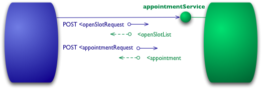
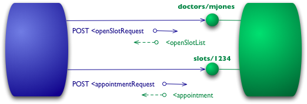

# Richardson 成熟度模型

- [Richardson 成熟度模型](#richardson-成熟度模型)
  - [级别 0](#级别-0)
  - [级别 1 —— 资源](#级别-1--资源)
  - [级别 2 —— HTTP 动词](#级别-2--http-动词)
  - [级别 3 —— 超媒体控制](#级别-3--超媒体控制)
  - [这些级别的意义](#这些级别的意义)
  - [致谢](#致谢)
  - [重要的修订](#重要的修订)

翻译[原文](https://martinfowler.com/articles/richardsonMaturityModel.html)。

通向 REST 的荣耀

一个模型(由 Leonard Richardson 开发)将 REST 方法的主要要素分解成三个步骤。这些步骤介绍资源、http 动词和超媒体控制。

最近我一直在阅读[《REST 实战》](https://www.amazon.com/gp/product/0596805829?ie=UTF8&tag=martinfowlerc-20&linkCode=as2&camp=1789&creative=9325&creativeASIN=0596805829)：我的一些同事一直在努力的一本书。他们的目的是介绍如何使用 Restful 网络服务来处理企业面临的许多集成问题。这本书的核心思想是，网络是大规模可扩展分布式系统的存在证明，该系统运行良好，而且我们可以从中汲取灵感，更加轻松地构建集成系统。


为了帮助解释网络风格系统的特殊属性，作者使用了由 [Leonard Richardson](http://www.crummy.com/) 开发的 restful 成熟度模型，并在 [QCon 演讲](http://www.crummy.com/writing/speaking/2008-QCon/act3.html)中解释了该模型。此模型是考虑使用这些技术的好方法，因此我认为自己应该对此做一些解释。(这里的协议示例只是说明性的，我认为不值得编码并对其测试，因此细节方面可能有问题。)

## 级别 0

此模型的起点是使用 HTTP 作为远程交互的传输系统，但不使用任何网络机制。本质上，你在这里所做的就是使用 HTTP 作为你自己的远程交互机制的隧道机制，远程交互机制通常基于[远程过程调用](http://www.eaipatterns.com/EncapsulatedSynchronousIntegration.html)。



假设我想要和医生预约。我的预约软件首先需要知道我的医生在给定日期有哪些空闲空缺，所以它请求医院预约系统以获取该信息。在级别 0 的场景中，医院会在某个 URI 出公开一个服务终端。然后我将包含了请求细节的文档发布到该终端。

```http
POST /appointmentService HTTP/1.1
[various other headers]

<openSlotRequest date = "2010-01-04" doctor = "mjones"/>
```

然后服务会返回一个文档提供这个信息给我。

```http
HTTP/1.1 200 OK
[various headers]

<openSlotList>
  <slot start = "1400" end = "1450">
    <doctor id = "mjones"/>
  </slot>
  <slot start = "1600" end = "1650">
    <doctor id = "mjones"/>
  </slot>
</openSlotList>
```

我在这里使用 XML 作为示例，但是内容实际上可以是任何格式：JSON、YAML、键值对或其它自定义格式。

我的下一步是登记预约，可以再次通过提交文档到终端实现。

```http
POST /appointmentService HTTP/1.1
[various other headers]

<appointmentRequest>
  <slot doctor = "mjones" start = "1400" end = "1450"/>
  <patient id = "jsmith"/>
</appointmentRequest>
```

如果一切正常我得到一个回复，说明我的预约已经登记。

```http
HTTP/1.1 200 OK
[various headers]

<appointment>
  <slot doctor = "mjones" start = "1400" end = "1450"/>
  <patient id = "jsmith"/>
</appointment>
```

如果有问题，提示另外一个人在我之前预约，那么我会在回复消息体得到一些错误消息。

```http
HTTP/1.1 200 OK
[various headers]

<appointmentRequestFailure>
  <slot doctor = "mjones" start = "1400" end = "1450"/>
  <patient id = "jsmith"/>
  <reason>Slot not available</reason>
</appointmentRequestFailure>
```

到目前为止，这是一个直接的 RPC 风格系统。这很简单因为它只是来回传递普通的旧 XML(POX)。如果使用 SOAP 或 XML-RPC，基本上是一样的机制，唯一的区别是用某种格式封装 XML 消息。

## 级别 1 —— 资源

RMM 通向 REST 荣耀的第一步是引入资源。因此现在不是将我们所有的请求给一个单独的服务终端，现在开始跟单独的资源会话。



因此对于我们的初始请求，可能对于指定的医生有一个资源。

```http
POST /doctors/mjones HTTP/1.1
[various other headers]

<openSlotRequest date = "2010-01-04"/>
```

回复携带了相同的基本信息，但是每个空缺现在是一个可以单独访问的资源。

```http
HTTP/1.1 200 OK
[various headers]

<openSlotList>
  <slot id = "1234" doctor = "mjones" start = "1400" end = "1450"/>
  <slot id = "5678" doctor = "mjones" start = "1600" end = "1650"/>
</openSlotList>
```

使用指定资源登记预约意味着发布预约到一个特定的空缺。

```http
POST /slots/1234 HTTP/1.1
[various other headers]

<appointmentRequest>
  <patient id = "jsmith"/>
</appointmentRequest>
```

如果一切正常我得到类似之前的回复。

```http
HTTP/1.1 200 OK
[various headers]

<appointment>
  <slot id = "1234" doctor = "mjones" start = "1400" end = "1450"/>
  <patient id = "jsmith"/>
</appointment>
```

现在的区别是如果有人需要对预约做任何操作，比如预约一些检测，他们首先获取预约资源，这些资源可能有一个类似 <http://royalhope.nhs.uk/slots/1234/appointment> 的 URI，并发布请求到这个资源。

对于像我这有的对象家伙，这就像对象身份的概念。与其在以太(ether)中调用一些函数并传递参数，不如在一个特定对象上调用一个方法，这个对象为其他信息提供参数。

## 级别 2 —— HTTP 动词

在级别 0 和 1 中我在所有交互都使用了 HTTP POST 动词，但是有些人代替或额外使用 GET。在这些级别上没有太大区别，它们都是用作隧道机制，允许你通过 HTTP 隧道交互。级别 2 远离这一点，使用的 HTTP 动词尽可能接近其在 HTTP 中的用法。


要获得空缺列表，意味着我们要使用 GET。

```http
GET /doctors/mjones/slots?date=20100104&status=open HTTP/1.1
Host: royalhope.nhs.uk
```

回复和使用 POST 的回复相同。

```http
HTTP/1.1 200 OK
[various headers]

<openSlotList>
  <slot id = "1234" doctor = "mjones" start = "1400" end = "1450"/>
  <slot id = "5678" doctor = "mjones" start = "1600" end = "1650"/>
</openSlotList>
```

在级别 2，对于这样的请求使用 GET 至关重要。HTTP 将 GET 定义为一个安全的操作，也就是说，它不会对任何状态进行重大更改。这使得我们可以任意顺序多次调用 GET，并且每次都获得相同的结果。这样做的一个重要结果是，它允许请求路由中的任何参与者都使用缓存，这是使得网络保持良好性能的关键因素。HTTP 包含各种支持缓存的方法，通信中的所有参与者都可以使用这些方法。通过遵循 HTTP 规则，我们可以利用其功能。

要登记一个预约，我们需要一个可以更改状态的 HTTP 动词，POST 或 PUT。我将使用与之前用过的相同的 POST。

```http
POST /slots/1234 HTTP/1.1
[various other headers]

<appointmentRequest>
  <patient id = "jsmith"/>
</appointmentRequest>
```

在这里使用 POST 和 PUT的权衡比我想在这里进行的讨论更多，也许有一天我会基于这些另外写一篇文章。但我确实想要指出，有一些人错误地在 POST/PUT 和创建/更新之间建立对应关系。二者的选择与此完全不同。

及时我使用级别 1 相同的 POST，远程服务的响应方式也存在一个显著的差异。如果一切正常，该服务的响应将携带 201 表示世界上已经有新资源。

```http
HTTP/1.1 201 Created
Location: slots/1234/appointment
[various headers]

<appointment>
  <slot id = "1234" doctor = "mjones" start = "1400" end = "1450"/>
  <patient id = "jsmith"/>
</appointment>
```

201 回复包含一个带有 URI 的 `Location` 属性，客户端将来可以使用该 URI 获取该资源的当前状态。这里的响应也包含该资源的表示形式，以节省客户端当前的额外呼叫。

如果出现问题(比如其他人预约了会话)还有另外一个区别。

There is another difference if something goes wrong, such as someone else booking the session.

```http
HTTP/1.1 409 Conflict
[various headers]

<openSlotList>
  <slot id = "5678" doctor = "mjones" start = "1600" end = "1650"/>
</openSlotList>
```

这个响应的重要部分是使用 HTTP 响应代码来指示出现了问题。在这种情况下，409 似乎是一个不错的选择，表示其他人以不兼容的方式更新了资源。在级别 2 上，我们没有使用 200 返回码而是包含一个错误响应，显式使用了这种错误响应。由协议设计者决定使用什么代码，但是如果出现错误，应该有一个非 2xx 的响应。级别 2 引入使用 HTTP 动词和 HTTP 响应码。

这里有一个不一致的地方。REST 倡导者谈论使用所有 HTTP 动词。他们还通过说 REST 试图从网络的实践成果中学习来证明他们的说法是正确的。但是在实践中，万维网很少使用 PUT 和 DELETE。有更多使用 PUT 和 DELETE 的合理原因，但是网络的存在证据并不是其中之一、

网络存在所支持的关键要素是强烈隔离安全操作(比如 GET)和非安全操作，以及使用状态码来帮助传达你遇到的各种错误。

## 级别 3 —— 超媒体控制

最终的级别介绍了你经常听到的一些事情，也就是丑陋的缩写 HATEOAS(超文本作为应用程序状态的引擎) 提及的内容。它解决了一个问题，即如何从空缺列表知道如何预约。


我们从初始化 GET 开始，它和级别 2 发送的相同。

```http
GET /doctors/mjones/slots?date=20100104&status=open HTTP/1.1
Host: royalhope.nhs.uk
```

但是回复有一个新元素。

```http
HTTP/1.1 200 OK
[various headers]

<openSlotList>
  <slot id = "1234" doctor = "mjones" start = "1400" end = "1450">
     <link rel = "/linkrels/slot/book" 
           uri = "/slots/1234"/>
  </slot>
  <slot id = "5678" doctor = "mjones" start = "1600" end = "1650">
     <link rel = "/linkrels/slot/book" 
           uri = "/slots/5678"/>
  </slot>
</openSlotList>
```

现在每个空缺有一个链接元素，它包含一个 URI 用来告诉我们如何预约。

超媒体控制的要点是它们告诉我们我们下一步可以做什么，以及我们进行操作所需的资源的 URI。回复中的超媒体控制会告诉我们如何操作，我们无需知道发送预约请求到哪个地方。

POST 请求和级别 2 的也相同。

```http
POST /slots/1234 HTTP/1.1
[various other headers]

<appointmentRequest>
  <patient id = "jsmith"/>
</appointmentRequest>
```

而且回复包含许多超媒体控制，用于接下来执行其他操作。

```http
HTTP/1.1 201 Created
Location: http://royalhope.nhs.uk/slots/1234/appointment
[various headers]

<appointment>
  <slot id = "1234" doctor = "mjones" start = "1400" end = "1450"/>
  <patient id = "jsmith"/>
  <link rel = "/linkrels/appointment/cancel"
        uri = "/slots/1234/appointment"/>
  <link rel = "/linkrels/appointment/addTest"
        uri = "/slots/1234/appointment/tests"/>
  <link rel = "self"
        uri = "/slots/1234/appointment"/>
  <link rel = "/linkrels/appointment/changeTime"
        uri = "/doctors/mjones/slots?date=20100104&status=open"/>
  <link rel = "/linkrels/appointment/updateContactInfo"
        uri = "/patients/jsmith/contactInfo"/>
  <link rel = "/linkrels/help"
        uri = "/help/appointment"/>
</appointment>
```

超媒体控制的一个显著好处是它允许服务器更改其 URI 格式且不会影响客户端。只要客户端查找 “addTest” 链接 URI，服务器团队就可以处理初始入口点以外的所有 URI。

另一个好处是，它可以帮助客户端开发者探索协议。这些链接向客户端开发者提示下一步可能发生的情况。它并未提供所有信息：“self” 和 “cancel” 控制都指向相同的 URI——他们需要确定一个是 GET，且另一个是 DELETE。但是至少它提供了一个思考的起点，以考虑如何获取更多信息以及在协议文档中寻找类似的 URI。

类似地，它允许服务器团队在回复中放置新链接来宣传新功能。如果客户端开发者注意未知的链接，那么这些链接可以触发进一步的探索。

关于如何表示超媒体控制没有绝对标准。我在这里使用的是 REST 实践团队的最新建议，即遵循 ATOM(RFC 4278)。我使用 `<link>` 元素，其中 uri 属性用于目标 URI，rel 属性用于描述关系种类。众所周知的关系(比如 self 用于引用元素本身)是空的，服务器的任何特定关系都是完全限定的 URI。ATOM 指出，众所周知的 linkrel 的定义是链接关系注册表。在我撰写本文时，这些内容仅限于 ATOM 的工作，而 ATOM 通常被视为级别 3 REST 的领导者。

## 这些级别的意义

我应该强调，RMM 虽然是思考 REST 要素的一种好方法，但并不是 REST 本身级别的定义。Roy Fielding 明确指出 3 级 RMM 是 REST 的前提条件。像软件中的许多术语一样，REST 有很多定义，但是由于 Roy Fielding 创造了该术语，因此他的定义应该比大多数术语更重要。

我发现这个 RMM 有用的地方在于，它提供了好的方法，可以逐步理解 restful 思考背后的基本思想。因此，我将其视为帮助我们了解概念的工具，而不是应在某种评估机制中使用的工具。我认为我们还没有足够的示例来确定 restful 方法是集成系统的正确方法。我确实认为这是一种非常吸引人的方法，并且大多数情况下我都会推荐此方法。

与 Ian Robinson 谈到这一点时，他强调说当 Leonard Richardson 首次提出该模型时，他发现该模型吸引人的一点是模型与常见设计技术的关系。

- 级别 1 通过使用分而治之解决了处理复杂性的问题，将大型服务端点分解为多个资源。
- 级别 2 引入了一组标准动词，以便我们以相同的方式处理类似的情况，从而消除了不必要的变体。
- 级别 3 引入了可发现性，从而提供方法使协议更能自我记录。

结果是一个模型，该模型可以帮助思考我们想要提供的 HTTP 服务的种类，并确定希望与之交互的人们的期望。

## 致谢

Savas Parastatidis、Ian Robinson 和 Jim Webber 对此草稿提供重要的注释。Leonard Richardson 帮助回答我的问题以便我可以最小化对他的想法的误解。Aaron Swartz 修正了我在级别 3 URI 的一些错误.

## 重要的修订

2010-3-18：第一次提交
